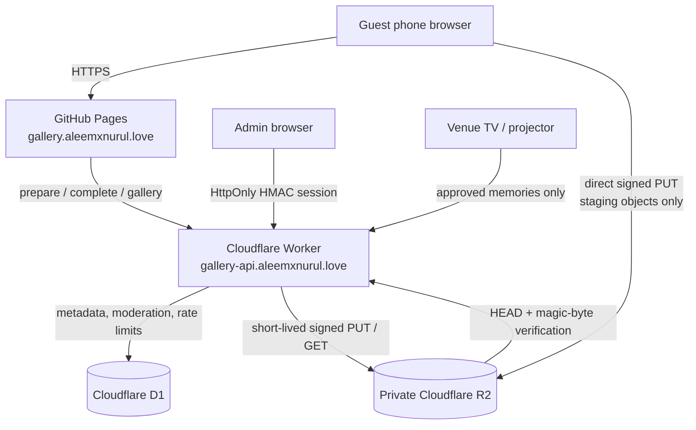

# Aleem × Nurul — Flight Memories

A production-oriented, browser-first wedding guest photo and video gallery for 21–22 August 2027. Guests can scan one QR code, take or choose media, add an optional name and message, upload without an account, and browse approved memories. The same site also provides a full-screen live wall, printable QR card, and a separate moderation console.

The frontend is static React + Vite on GitHub Pages. The API is a Cloudflare Worker backed by private R2 storage and D1 metadata. Phase 2 adds Cloudflare Queues, Workflows, Workers AI, a semantic Vectorize index, an optional provider-neutral face index, and a trusted streaming archive-builder CLI. Detailed flows are in [`docs/phase2-architecture.md`](docs/phase2-architecture.md).

## Architecture



Uploads never send large media bytes through Worker memory. The Worker validates the request, creates an `uploading` D1 record, and returns 10-minute S3-compatible signed R2 URLs for a disposable `staging/` prefix. The browser uploads directly to R2. The Worker then verifies object existence, exact size, signed content type, and file signature before using R2's server-side `CopyObject` operation to promote valid objects into never-signed final keys and move the record to `pending` or `approved`.

## What is included

- Mobile-first guest flow with camera capture and multi-file selection.
- Up to 20 files per batch; 25 MB images and 250 MB videos by default.
- JPEG, PNG, WebP, HEIC/HEIF, MP4, MOV, and WebM admission checks.
- Original-preserving browser derivatives: ~1800 px WebP display and 480 px WebP thumbnail.
- Per-file and overall upload progress, partial-failure recovery, and individual retry.
- Singapore-time event defaulting for 21 and 22 August 2027.
- SHA-256 duplicate fingerprints scoped to the same browser and event.
- Approved-only paginated gallery, filters, lazy thumbnails, lightbox, keyboard/swipe navigation, and sharing.
- English and Bahasa Melayu guest interface with local preference storage.
- `/live` polling wall with non-repeating rotation, preloading, muted video, filters, QR, and fullscreen mode.
- `/qr` high-contrast printable boarding card.
- `/admin` password login, HMAC-signed HttpOnly session, statistics, storage breakdown, moderation, event switches, auto-approval, and live-wall controls.
- Private R2, exact-origin CORS, Turnstile, hashed IP/session rate limits, post-upload verification, and scheduled stale-upload cleanup.
- D1 migrations, GitHub Pages and Worker workflows, generated non-copyrighted preview artwork, and automated frontend/Worker tests.
- `/explore` category browsing, natural-language semantic search, URL-addressable filters, and device-local favourites.
- Consent-first `/find-me` similarity search with transient selfies, private vectors, model-specific calibration, and a global/per-photo kill switch. Production remains intentionally disabled until a real no-retention provider is selected.
- Durable AI outbox, Queue/Workflow processing, independent caption/category/semantic/face states, controlled backfills, retries, dead-letter handling, and structured safe logs.
- Explicit live, post-wedding, and archive modes.
- Immutable archive inventories, deterministic ZIP64 shards, SHA-256 manifests, resumable lease-fenced construction, and short-lived private downloads.

Generation provenance, saved paths, and the exact image prompt are recorded in [`docs/IMAGE_ASSETS.md`](docs/IMAGE_ASSETS.md).

## Repository map

```text
.
├── src/
│   ├── components/        guest, upload, gallery, QR, and admin UI
│   ├── context/           locale state
│   ├── data/              generated development preview records
│   ├── i18n/              English / Bahasa Melayu copy
│   ├── pages/             home, live wall, QR, and admin routes
│   ├── services/          API and resilient direct-upload client
│   ├── styles/            shared design system and responsive surfaces
│   ├── types/             browser-only types
│   └── utils/             dates, validation, fingerprints, derivatives
├── shared/contracts.ts    frontend / Worker request-response contracts
├── worker/
│   ├── migrations/        production D1 schema and event seed
│   ├── seeds/             optional local development marker
│   ├── src/               API routes, security, R2, and scheduled cleanup
│   ├── wrangler.toml      D1, R2, cron, vars, and custom domain
│   └── r2-cors.*.json     separate production / local CORS policies
├── public/                CNAME, privacy files, OG art, and generated samples
└── .github/workflows/     GitHub Pages and Worker deployment
```

## Local frontend

Requirements: Node.js 24+ and npm 11+.

```bash
npm install
cp .env.example .env.local
npm run dev
```

PowerShell equivalent: `Copy-Item .env.example .env.local`.

The default local experience uses generated, clearly labelled preview media and simulated uploads, so `/`, `/admin`, `/live`, and `/qr` are immediately reviewable without Cloudflare credentials.

To connect the frontend to a Worker, set this in `.env.local` and restart Vite:

```dotenv
VITE_API_BASE_URL=http://localhost:8787
VITE_TURNSTILE_SITE_KEY=1x00000000000000000000AA
VITE_USE_MOCK_DATA=false
```

Vite variables are public browser configuration. Never put R2 credentials, Turnstile secrets, or the admin password in a `VITE_` variable.

## Local Worker and D1

Authenticate Wrangler:

```bash
npx wrangler login
```

Create a local secrets file from the safe example:

```bash
cp worker/.dev.vars.example worker/.dev.vars
```

PowerShell equivalent: `Copy-Item worker/.dev.vars.example worker/.dev.vars`.

Apply the D1 schema to Wrangler's local persisted state and start the Worker:

```bash
npm run db:migrate:local
npm run db:seed:local
npm run dev:worker
```

The development seed adds metadata-only pending/rejected photo and video rows for D1 statistics and moderation tests. The default frontend mock mode supplies the generated visual media because local Wrangler S3 URLs are not browser-equivalent to hosted R2.

The explicit Turnstile bypass only works when `ENVIRONMENT=development`, `TURNSTILE_BYPASS=true`, and the client sends the exact development token. Production refuses a bypass configuration.

Wrangler's local R2 binding is useful for API and cleanup development, but local S3 presigned URLs do not represent the hosted R2 S3 endpoint. Use the frontend's simulated-upload mode for ordinary local UI work. Use a separately deployed development Worker and development bucket for a true end-to-end signed-upload smoke test.

Keep the browser and API hostnames consistent during local admin testing: use `localhost` for both URLs, or `127.0.0.1` for both. Mixing them can prevent the development `SameSite=Strict` admin cookie from being sent.

## Create the production Cloudflare resources

Run these after `wrangler login`:

```bash
npx wrangler r2 bucket create aleem-nurul-gallery
npx wrangler d1 create aleem-nurul-gallery-db
```

The D1 command prints a database UUID. The committed `worker/wrangler.toml` currently contains the intended production database/account identifiers; compare them with `wrangler d1 list` and `wrangler whoami` before any deployment. If this project is moved to another account, replace both identifiers with the exact values returned for that account.

Apply the schema remotely:

```bash
npx wrangler d1 migrations apply aleem-nurul-gallery-db --remote --config worker/wrangler.toml --env=""
```

D1 migrations are applied transactionally and Wrangler captures a backup before each production migration.

### Create bucket-scoped R2 signing credentials

The Worker R2 binding can inspect and delete objects, but S3-compatible credentials are required to mint browser presigned URLs.

1. Open Cloudflare Dashboard → **R2 Object Storage** → **Manage R2 API tokens**.
2. Create an **Object Read & Write** token restricted to `aleem-nurul-gallery`.
3. Save the access key ID and secret access key when shown. The secret is only displayed once.
4. Do not enable the bucket's `r2.dev` public URL or attach a public bucket domain.

Apply the production R2 CORS rule:

```bash
npx wrangler r2 bucket cors set aleem-nurul-gallery --file worker/r2-cors.production.json --force
npx wrangler r2 bucket lifecycle add aleem-nurul-gallery expire-gallery-staging staging/ --expire-days 1
```

API CORS and R2 bucket CORS are separate. The production R2 rule permits only `https://gallery.aleemxnurul.love` and the exact signed `Content-Type` / `If-None-Match` headers. The one-day `staging/` lifecycle is a backstop; scheduled cleanup normally removes staged objects shortly after the last PUT expires.

## Configure Turnstile

1. Cloudflare Dashboard → **Turnstile** → **Add widget**.
2. Add `gallery.aleemxnurul.love` as the production hostname.
3. Put the public site key in the GitHub Actions variable `VITE_TURNSTILE_SITE_KEY`.
4. Put the secret key in the Worker secret `TURNSTILE_SECRET_KEY`.

The Worker checks `success`, hostname, action `upload_prepare`, expiry, and single-use validation. The example local keys are Cloudflare's documented test keys and are not production credentials.

## Worker secrets

Generate strong independent values for the admin password and both signing secrets. For example:

```bash
openssl rand -base64 36
openssl rand -base64 48
openssl rand -base64 48
```

Set each value interactively; do not paste it into a committed file:

```bash
npx wrangler secret put R2_ACCESS_KEY_ID --config worker/wrangler.toml --env=""
npx wrangler secret put R2_SECRET_ACCESS_KEY --config worker/wrangler.toml --env=""
npx wrangler secret put TURNSTILE_SECRET_KEY --config worker/wrangler.toml --env=""
npx wrangler secret put ADMIN_PASSWORD --config worker/wrangler.toml --env=""
npx wrangler secret put ADMIN_SESSION_SECRET --config worker/wrangler.toml --env=""
npx wrangler secret put RATE_LIMIT_SECRET --config worker/wrangler.toml --env=""
npx wrangler secret put ARCHIVE_BUILDER_TOKEN --config worker/wrangler.toml --env=""
npx wrangler secret put MAINTENANCE_TOKEN --config worker/wrangler.toml --env=""
```

`ADMIN_SESSION_SECRET`, `RATE_LIMIT_SECRET`, `ARCHIVE_BUILDER_TOKEN`, and `MAINTENANCE_TOKEN` should each contain at least 32 random characters and be mutually independent. Raw IP addresses are not written to D1; rate-limit keys are HMAC-hashed first.

## Production configuration reference

Non-secret production settings live in `worker/wrangler.toml`; browser-visible settings live in the GitHub Pages workflow or `.env.local`.

| Setting | Production value / purpose |
| --- | --- |
| `R2_ACCOUNT_ID` | The 32-character account ID from Cloudflare; replace the placeholder. |
| `R2_BUCKET_NAME` | `aleem-nurul-gallery`; must match the private bucket and scoped signing token. |
| `ALLOWED_ORIGIN` | Exact single origin `https://gallery.aleemxnurul.love`; production rejects comma-separated or non-HTTPS values. |
| `TURNSTILE_EXPECTED_HOSTNAME` | `gallery.aleemxnurul.love`; must match `ALLOWED_ORIGIN`. |
| `TURNSTILE_BYPASS` | Must remain `false` in production. |
| `AUTO_APPROVE_UPLOADS` | Default moderation mode; `false` sends completed uploads to the pending queue. Admin can override it at runtime. |
| `UPLOAD_URL_TTL_SECONDS` | Signed PUT lifetime; default 600 seconds and clamped to 60–900 seconds. |
| `ADMIN_SESSION_TTL_SECONDS` | Admin session lifetime; default 28,800 seconds (8 hours), clamped to 15 minutes–24 hours. |
| `SOFT_STORAGE_WARNING_GB` | Informational dashboard warning; default 450 GB. |
| `HARD_STORAGE_LIMIT_GB` | Optional admission cap. Leave empty for unlimited storage. |
| `VITE_API_BASE_URL` | Public Worker origin compiled into the Pages build. |
| `VITE_TURNSTILE_SITE_KEY` | Public Turnstile site key compiled into the Pages build; it is not a secret. |
| `VISION_MODEL` | Workers AI model for controlled caption/category JSON; currently `@cf/google/gemma-4-26b-a4b-it`. |
| `SEMANTIC_MODEL` | Text embedding model; currently `@cf/qwen/qwen3-embedding-0.6b`. |
| `SEMANTIC_EMBEDDING_DIMENSIONS` | Must stay `1024` for the committed semantic index. |
| `AI_PROCESSING_MAX_PER_MINUTE` | D1-backed provider-stage reservation cap; production default `30`. |
| `FACE_PROVIDER` | Empty in production until provider review, index creation, and calibration are complete. |
| `FIND_ME_MAX_IMAGE_BYTES` | Transient selfie limit; 6 MiB by default and hard-clamped to 10 MiB. |
| `SEARCH_SESSION_TTL_SECONDS` | Anonymous timestamp-only Find Me session lifetime; 600 seconds by default. |
| `ARCHIVE_DOWNLOAD_TTL_SECONDS` | Private archive signed-download lifetime; 600 seconds by default. |

`ENVIRONMENT=production` is deliberate. The Worker validates all production identifiers and secrets at request startup and fails closed if a placeholder or development bypass remains.

## Deploy the Worker

Validate the Worker bundle without deploying:

```bash
npm run typecheck:worker
npm run build:worker
```

Deploy after the resource IDs and secrets are configured:

```bash
npx wrangler deploy --config worker/wrangler.toml --env=""
```

The config declares `gallery-api.aleemxnurul.love` as a Worker custom domain. The zone must be active in the same Cloudflare account. Confirm the domain in **Workers & Pages → aleem-nurul-gallery-api → Settings → Domains & Routes**; Cloudflare creates/manages the custom-domain DNS record rather than requiring an invented Worker target.

The cron runs every 15 minutes. It reconciles expired `uploading` records, salvages valid originals into moderation, purges invalid/incomplete objects, finishes interrupted deletions, re-purges keys that a still-valid PUT URL could recreate, and clears expired request/rate-limit/session rows. Each pass uses bounded batches sized to remain below D1's 50-query Workers Free invocation limit; a large backlog drains over subsequent passes while the one-day R2 lifecycle remains the safety net.

## GitHub Pages

1. Push this repository to GitHub with `main` as the production branch.
2. Repository **Settings → Pages → Build and deployment → Source**: choose **GitHub Actions**.
3. Repository **Settings → Secrets and variables → Actions → Variables**: add `VITE_TURNSTILE_SITE_KEY`.
4. Run **Deploy gallery to GitHub Pages** or push to `main`.
5. In **Settings → Pages**, set the custom domain to `gallery.aleemxnurul.love` and enable HTTPS after the certificate is ready.

`public/CNAME` is already included. The workflow lints, tests, builds, and deploys `dist/`. `public/404.html` preserves clean `/live`, `/admin`, and `/qr` routes when GitHub Pages serves its SPA fallback.

## Worker GitHub Actions

Create a dedicated, least-privilege Cloudflare token for this workflow:

1. Cloudflare Dashboard → **My Profile → API Tokens → Create Token → Create Custom Token**.
2. Add account permissions **Account Settings: Read**, **Workers Scripts: Edit**, **D1: Edit**, and **Workers R2 Storage: Edit** (the current UI may label the last permission “Write”).
3. Add zone permission **Workers Routes: Edit** for only the `aleemxnurul.love` zone so Wrangler can manage the declared Worker custom domain.
4. Scope **Account Resources** to the one wedding-gallery account and **Zone Resources** to the one wedding domain; do not select all accounts or zones.
5. Create the token, copy it once, and store it only as the GitHub secret below. This deployment token is separate from the bucket-scoped S3 access key used by the Worker to sign media URLs.

In GitHub, open **Repository Settings → Secrets and variables → Actions → Secrets → New repository secret** and add:

- `CLOUDFLARE_API_TOKEN`
- `CLOUDFLARE_ACCOUNT_ID`

The **Deploy gallery API Worker** workflow type-checks and tests, applies unapplied D1 migrations remotely, and only then deploys the Worker. It also supports manual `workflow_dispatch`.

## DNS handoff

Do not guess provider-specific targets.

- `gallery.aleemxnurul.love`: use the exact CNAME target shown by GitHub in **Repository Settings → Pages → Custom domain**. If Cloudflare hosts DNS, start DNS-only while GitHub validates and provisions HTTPS; adjust proxying only after the custom domain is healthy.
- `gallery-api.aleemxnurul.love`: confirm the Worker custom domain in Cloudflare's **Domains & Routes** screen. The Wrangler `custom_domain` declaration provisions the appropriate record inside the active Cloudflare zone.

Verify both hostnames over HTTPS before placing the QR code at the venue.

## R2 object layout

```text
staging/2027-08-21/<uuid>/original.jpg        # temporary signed target
staging/2027-08-21/<uuid>/display.webp
staging/2027-08-21/<uuid>/thumbnail.webp

originals/2027-08-21/<uuid>/original.jpg
display/2027-08-21/<uuid>.webp
thumbnails/2027-08-21/<uuid>.webp
```

The same layout is used for 22 August. UUIDs and keys are generated by the Worker; original filenames are metadata only. Guests can write only to `staging/`. Final gallery keys are created by authenticated, server-side R2 copies and are never exposed as PUT targets.

## API surface

```text
GET    /api/events
POST   /api/uploads/prepare
POST   /api/uploads/:id/refresh
POST   /api/uploads/:id/complete
GET    /api/gallery
GET    /api/gallery/:id
GET    /api/gallery/:id/download
POST   /api/gallery/lookup
GET    /api/live/config
GET    /api/capabilities
GET    /api/discovery/categories
POST   /api/discovery/search
GET    /api/find-me/status
POST   /api/find-me/search

POST   /api/admin/login
POST   /api/admin/logout
GET    /api/admin/session
GET    /api/admin/stats
GET    /api/admin/media
PATCH  /api/admin/media/batch
DELETE /api/admin/media/:id
GET    /api/admin/settings
PATCH  /api/admin/settings
GET    /api/admin/ai/stats
GET    /api/admin/ai/jobs
POST   /api/admin/ai/backfill
POST   /api/admin/ai/jobs/:id/retry
POST   /api/admin/ai/jobs/:id/dismiss
PATCH  /api/admin/media/:id/face-search
POST   /api/admin/media/:id/categories
GET    /api/admin/ai/face-calibrations
POST   /api/admin/ai/face-calibrations
POST   /api/admin/ai/face-calibrations/compare
POST   /api/admin/ai/purge-faces
GET    /api/admin/archive
POST   /api/admin/archive
POST   /api/admin/archive/:id/cancel
POST   /api/admin/archive/:id/download

# Trusted bearer-only operator APIs (not browser APIs)
GET/POST/PATCH /api/archive-builder/jobs/:id/...
POST           /api/maintenance/ai/purge-faces
```

All responses use a typed `{ ok, data }` or `{ ok, error }` envelope. Raw D1, R2, stack, and exception details are never returned to guests.

## Phase 2 production rollout

Phase 1 remains the deployable core. AI provider failures never block upload completion, moderation, approved gallery browsing, or original-media retention. Roll Phase 2 out in this order and do not enable Find Me merely because the UI exists.

Before changing production, export D1 to a path outside this repository:

```bash
npx wrangler d1 export aleem-nurul-gallery-db --remote --config worker/wrangler.toml --env="" --output ../aleem-nurul-pre-phase2.sql
```

Create the queues and semantic index once:

```bash
npx wrangler queues create gallery-ai-dead-letter
npx wrangler queues create gallery-ai-processing
npx wrangler queues create gallery-cleanup
npx wrangler vectorize create aleem-nurul-wedding-semantic --dimensions=1024 --metric=cosine

npx wrangler queues list
npx wrangler vectorize info aleem-nurul-wedding-semantic
```

Then set all Worker secrets, apply migrations, validate locally, and deploy:

```bash
npx wrangler d1 migrations list aleem-nurul-gallery-db --remote --config worker/wrangler.toml --env=""
npx wrangler d1 migrations apply aleem-nurul-gallery-db --remote --config worker/wrangler.toml --env=""

npm run lint
npm test
npm run build
npm run build:worker
npx wrangler deploy --config worker/wrangler.toml --env=""
```

No command in this README was run against the production account as part of this implementation. Review identifiers and authentication before executing remote commands.

## Vectorize setup

The semantic index is selected and committed: Qwen3 Embedding 0.6B emits 1,024 dimensions and the index uses cosine distance. Do not change only one side. A model or dimension change requires a new index name or a full controlled re-index; persist the new version in D1 and switch the binding only after validation.

Production `FACE_INDEX` is deliberately absent. After a face provider has supplied its documented model, version, dimensions, recommended metric, and score semantics, create a separate index by replacing both placeholders with verified facts:

```bash
npx wrangler vectorize create aleem-nurul-wedding-faces-v1 --dimensions=<VERIFIED_DIMENSIONS> --metric=<cosine|euclidean|dot-product>
```

Then add this production binding to `worker/wrangler.toml`:

```toml
[[vectorize]]
binding = "FACE_INDEX"
index_name = "aleem-nurul-wedding-faces-v1"
```

Never reuse the semantic index for faces or mix face vectors from incompatible model versions.

## Queues setup

`gallery-ai-processing` carries small analysis job messages; `gallery-cleanup` carries deletion/purge jobs; `gallery-ai-dead-letter` receives exhausted deliveries. Consumer retry, concurrency, and batch limits are declared in `worker/wrangler.toml`. D1 `ai_jobs` is the durable outbox, so a database transition and its future work request are committed together. The 15-minute scheduled task redispatches eligible outbox rows if a Queue send was interrupted.

Queue messages contain only job/media IDs, schema versions, and a per-dispatch fencing token. They never contain original media, selfies, vectors, signed URLs, or credentials.

## Workflow setup

There is no separate Wrangler “create Workflow” command. `gallery-media-analysis` is provisioned from `[[workflows]]` during `wrangler deploy`. Each successful outbox dispatch gets one deterministic Workflow instance ID derived from its fencing token. Redeliveries reuse that instance, while D1 atomically verifies the active job, token, Workflow ID, and model generation before any result can commit.

Inspect it after deployment:

```bash
npx wrangler workflows describe gallery-media-analysis --config worker/wrangler.toml
npx wrangler workflows instances list gallery-media-analysis --config worker/wrangler.toml
npx wrangler tail aleem-nurul-gallery-api --config worker/wrangler.toml --format pretty
```

Caption/category, semantic, and face tasks keep independent state. A job can end `partial`; retrying does not hide or duplicate the underlying gallery memory.

## Workers AI binding

The `[ai]` binding exposes Workers AI as `env.AI`; Wrangler provisions the binding at deploy time. Private display-derivative bytes are passed to the vision model, and sanitized caption/category text is passed to the embedding model. R2 is not made public for AI processing.

Production configuration rejects `MOCK_AI=true`. Development uses deterministic mocks so tests do not call paid providers or require remote indexes.

## AI model configuration

| Feature | Provider/model | Stored provenance | Why |
| --- | --- | --- | --- |
| Captions and controlled categories | Workers AI `@cf/google/gemma-4-26b-a4b-it` | model plus application label `2026-04`, schema version 1 | Multimodal model available through the existing Cloudflare trust boundary; output is still schema-validated and restricted to the wedding taxonomy. |
| Semantic search | Workers AI `@cf/qwen/qwen3-embedding-0.6b` | model plus application label `2025-06`, 1,024 dimensions, cosine | Cloudflare documents its 1,024-dimensional embedding output and cosine use; it is inexpensive and avoids a second external text provider. |
| Face similarity | No production model selected | none | A dedicated model, retention contract, dimensions, metric, score bounds, and calibration have not been verified. Production Find Me therefore fails closed. |

The version labels are operator provenance labels, not a claim that a vendor model is immutable. When a configured model changes, create/re-index deliberately and never mix incompatible embeddings.

Vision output is Zod-validated, bounded, sensitive-attribute language is filtered, and only the controlled categories are persisted. AI captions are a fallback when guest/manual description is absent; they are not identity assertions.

## Face provider configuration

The built-in production adapter accepts only `FACE_PROVIDER=external`. It POSTs the original bounded image bytes to an exact HTTPS endpoint with bearer authentication and expects:

```json
{
  "faces": [
    {
      "bounds": { "x": 0.1, "y": 0.1, "width": 0.4, "height": 0.4 },
      "quality": 0.9,
      "embedding": [0.01, 0.02]
    }
  ]
}
```

Coordinates and quality are normalized to 0–1; the embedding must have exactly the configured dimension. The request includes model/version headers and `X-Data-Retention: none`, but the operator must verify that the provider contract actually prohibits retention and training.

Only after due diligence, add non-secret production values:

```toml
FACE_PROVIDER = "external"
FACE_PROVIDER_ENDPOINT = "https://verified-provider.example/v1/detect-and-embed"
FACE_EMBEDDING_MODEL = "verified-model-name"
FACE_EMBEDDING_MODEL_VERSION = "verified-immutable-version"
FACE_EMBEDDING_DIMENSIONS = "<VERIFIED_DIMENSIONS>"
FACE_DISTANCE_METRIC = "<VERIFIED_METRIC>"
FACE_SCORE_MIN = "<DOCUMENTED_MINIMUM>"
FACE_SCORE_MAX = "<DOCUMENTED_MAXIMUM>"
```

Store the conditional key separately:

```bash
npx wrangler secret put FACE_PROVIDER_API_KEY --config worker/wrangler.toml --env=""
```

`FACE_SCORE_MIN/MAX` are provider-documented bounds, not match thresholds. Match and strong-match thresholds live in the active D1 calibration row for the exact provider/model/version/dimensions/metric tuple. `FACE_PROVIDER`, `FACE_INDEX`, and calibration must all agree or `/find-me` remains unavailable.

## Backfilling existing photos

Keep Find Me disabled initially. In `/admin/ai`, use **Process remaining** for records without current analysis or **Retry failed** for recoverable failures. Moderation also supports a selected-media reprocess action. Backfill requests are capped, idempotent, and dispatched gradually; repeat **Process remaining** until the remaining count reaches zero.

`AI_PROCESSING_MAX_PER_MINUTE=30` limits provider-stage reservations, not raw Queue deliveries. A typical photo uses vision plus semantic reservations and, only when configured, a face-provider reservation. Pause/resume changes D1 runtime state without redeploying. Review failures and dead-letter error codes before raising the cap.

Videos are analysed only when a private `video_preview_object_key` exists. This repository preserves uploaded videos but does not generate that preview, so ordinary videos correctly remain without Phase 2 AI output.

## Calibration

1. Leave global Find Me disabled.
2. Configure the verified face provider and matching private index.
3. In `/admin/ai/face-calibration`, compare many consented, representative same-person pairs and hard different-person pairs across lighting, camera, pose, attire, and occlusion.
4. Treat the displayed raw cosine/dot/euclidean calculations as diagnostics. Confirm how the selected Vectorize metric transforms/sorts scores from provider documentation and real index queries.
5. Prefer false negatives over false positives. Choose a possible-match threshold and a higher/equal strong threshold inside the documented score range; record sample size and rationale in notes.
6. Type `USE THESE THRESHOLDS` to activate the exact tuple, index a small sample, and manually review it.
7. Enable Find Me only after privacy, false-positive, deletion, per-photo exclusion, and global-disable rehearsals pass.

Changing any tuple field makes the old calibration inapplicable. Recalibrate and re-index rather than copying thresholds.

## Privacy behaviour

Find Me is voluntary selfie-to-photo visual-similarity search, not identity verification. Consent starts unchecked. Selfie bytes and the query vector exist only for the bounded request, are overwritten where practical, and are never put in R2, D1, Vectorize, admin screens, or intentional logs. Results are candidate matches revalidated against approved, non-deleted, face-enabled D1 rows.

Persistent wedding-photo face vectors are private and have no name attached. Per-photo exclusion and a global kill switch are available. Full implementation, provider obligations, deletion races, stored fields, and archive exclusions are documented in [`docs/privacy-ai.md`](docs/privacy-ai.md).

## Event modes

| Mode | Behaviour |
| --- | --- |
| `live` | Admin-controlled uploads and live wall can operate; discovery is available; archive creation is blocked. |
| `post-wedding` | Uploads/live wall are off; gallery/discovery remain; archive generation is available. |
| `archive` | Uploads/live wall/Find Me/semantic search are off; category/gallery access and archive downloads remain with reduced background activity. |

Modes are stored in D1 and changed explicitly in `/admin/settings`; dates never switch them automatically.

## Archive generation

An administrator creates an immutable inventory at `/admin/archive` while in `post-wedding` or `archive` mode. The snapshot includes pending, approved, and rejected originals and excludes deleted/deleting/expired rows. It captures event sequence, source/moderation state, original filename, media metadata, guest name/message, categories, and AI caption.

The ordinary Worker never constructs a multi-gigabyte ZIP. A trusted Node.js 24+ CLI streams originals from private R2 into deterministic, uncompressed ZIP64 shards and multipart-streams them back to immutable private keys. It computes SHA-256 on exact original and ZIP bytes, persists the complete part plan before building, and uses lease generations to fence stale builders.

The four root artifacts are `README.txt`, `manifest.json`, `manifest.csv`, and `checksums.sha256`. Face/search/session/rate-limit/secret data is excluded. See [`docs/archive-restore.md`](docs/archive-restore.md) before building or deleting any cloud data.

Add an R2 backstop for abandoned archive multipart uploads; it does not delete completed objects:

```bash
npx wrangler r2 bucket lifecycle add aleem-nurul-gallery abort-stale-archive-multipart archives/ --abort-multipart-days 1 --force
npx wrangler r2 bucket lifecycle list aleem-nurul-gallery
```

## Archive builder CLI

Required command environment:

```text
ARCHIVE_API_URL
ARCHIVE_BUILDER_TOKEN
R2_ACCOUNT_ID
R2_BUCKET_NAME
R2_ACCESS_KEY_ID
R2_SECRET_ACCESS_KEY
```

Dry-run needs only the API URL/token. Build examples:

```bash
npm run archive:build -- --job <JOB_UUID> --all --shard-size 5GiB --dry-run
npm run archive:build -- --job <JOB_UUID> --all --shard-size 5GiB
npm run archive:build -- --job <JOB_UUID> --all --shard-size 5GiB --resume
npm run archive:build -- --job <JOB_UUID> --event solemnisation --resume
```

The CLI keeps resumable state under ignored `.archive-state/`. It does not write complete ZIPs to disk or hold them in RAM, but it does hold inventory/global-manifest metadata in memory. Memory use depends on filename/message length and must be measured with a representative 100,000-item staging rehearsal before the final run; do not rely on a fixed RAM estimate. Each shard is also capped at 10,000 files. Parts are independent ZIPs and must not be concatenated. A one-event run on an all-event job intentionally leaves the job `partial`.

## Archive restore instructions

Download every part and all four root artifacts into the exact layout described in [`docs/archive-restore.md`](docs/archive-restore.md). Verify the `parts/` checksum lines first, test every ZIP with a ZIP64-capable tool, extract each part into a separate staging directory, then merge its event folders. Once originals are extracted, the complete root checksum file can verify both originals and ZIPs. Use JSON/CSV plus sidecar metadata to rebuild an independent catalogue.

The archive is application-independent, but there is no automated importer that recreates the live D1/R2 application. Keep at least two verified copies on separate media before considering any explicit R2 original deletion.

An archive snapshot never mutates. If source media is later deleted, the Worker invalidates that job's download API. Existing private archive bytes are not automatically removed; retention/deletion of exact `archives/<job-id>/...` objects is a separate reviewed operation.

## Purging face embeddings

The admin flow requires Find Me to be disabled and the exact phrase `PURGE FACE INDEX`. The maintenance CLI disables it before enqueueing the same bounded purge:

```bash
# Set MAINTENANCE_API_URL and MAINTENANCE_TOKEN in the current process first.
npm run ai:purge-faces -- --confirm "PURGE FACE INDEX"
```

It deletes private face vectors and D1 face references while retaining media, captions, categories, and semantic search. Keep the matching `FACE_INDEX` binding available until the job completes; removing it first causes cleanup to fail closed. Re-enabling later requires a full compatible face backfill and active calibration.

## Phase 2 D1 migrations

Apply in order through Wrangler:

- `0003_phase2.sql`: AI task/model state, controlled categories, private face/semantic references, durable jobs/rate windows/search sessions, runtime settings, and archive snapshot tables.
- `0004_archive_resume.sql`: persisted part plan hashes for safe resume.
- `0005_archive_integrity.sql`: lease generations, full snapshot metadata, durable plan/plan-item tables, and archive filename uniqueness.
- `0006_ai_generation_fencing.sql`: moderation/face revisions, active AI-generation ownership, Queue dispatch tokens, and safe migration of pre-token deliveries.
- `0007_archive_query_indexes.sql`: composite indexes supporting archive paging, part validation, and privacy invalidation at large inventory sizes.
- `0008_archive_index_refinement.sql`: removes the superseded paging index and adds ordered event-scoped inventory paging.

Never edit an applied migration. Add a new numbered migration and test it against a copy/local persisted D1 first.

## R2 CORS and lifecycle

The R2 API requires the committed CORS document to have a top-level `rules` array. `worker/r2-cors.production.json` has the required shape:

```json
{
  "rules": [
    {
      "allowed": {
        "origins": ["https://gallery.aleemxnurul.love"],
        "methods": ["GET", "HEAD", "PUT"],
        "headers": ["Content-Type", "If-None-Match"]
      },
      "exposeHeaders": ["ETag"],
      "maxAgeSeconds": 3600
    }
  ]
}
```

Apply and inspect it with:

```bash
npx wrangler r2 bucket cors set aleem-nurul-gallery --file worker/r2-cors.production.json --force
npx wrangler r2 bucket cors list aleem-nurul-gallery
```

API CORS is separate. A valid browser request supplies `Origin` automatically; scripts and unit tests must supply the exact allowed Origin for protected endpoints. `ORIGIN_REQUIRED` means the request lacked it, not that the R2 bucket rule failed.

The deployment workflow expires only `staging/` objects and aborts incomplete archive multipart uploads. The application never persists face crops under `temporary-ai/`; therefore no such lifecycle is required. Never apply automatic expiry to `originals/` or the complete `archives/` prefix.

## Phase 2 cost model

Pricing below was verified against Cloudflare's published pages on 3 September 2026 and can change. It is an illustrative monthly model, not a quote. Review [Workers AI](https://developers.cloudflare.com/workers-ai/platform/pricing/), [Workers](https://developers.cloudflare.com/workers/platform/pricing/), [Queues](https://developers.cloudflare.com/queues/platform/pricing/), [Workflows](https://developers.cloudflare.com/workflows/reference/pricing/), [Vectorize](https://developers.cloudflare.com/vectorize/platform/pricing/), [D1](https://developers.cloudflare.com/d1/platform/pricing/), and [R2](https://developers.cloudflare.com/r2/pricing/) before rollout.

Verified model list prices are $0.10/M vision input tokens and $0.30/M output tokens for Gemma 4 26B A4B, and $0.012/M input tokens for Qwen3 Embedding 0.6B. The dedicated Workers Paid account minimum is $5/month. Included paid-plan allowances often cover the Queue/Workflow/D1 operation volume below; R2 internet egress is free, but storage and operations remain billable.

Illustrative assumptions: 1,500 vision input tokens, 150 vision output tokens, and 80 semantic tokens per new photo; semantic searches/month equal 20% of photo count at 8 tokens/query; 5 MB original + 0.5 MB display + 0.05 MB thumbnail + one 5 MB stored archive copy per photo; no retries; no production face feature; other Worker/Queue/D1/R2 operations stay inside included amounts.

| New photos / retained copies | Workers AI gross | R2 GB-month estimate | Semantic Vectorize | Workflow overage | Illustrative monthly total |
| ---: | ---: | ---: | ---: | ---: | ---: |
| 10,000 | $1.96 | $1.44 | < $0.01 | $0.00 | about $8.40 |
| 25,000 | $4.90 | $3.81 | $0.01 | $0.00 | about $13.72 |
| 100,000 | $19.60 | $15.68 | $0.78 | $0.80 | about $41.85 |

These totals include the $5 Worker minimum and are before Workers AI's daily free Neuron allocation. Replace token/storage assumptions with dashboard measurements after a representative pilot. They exclude external face-provider charges, face-vector dimensions/volume, public traffic, retries/reprocessing, archive-builder host/network cost, and shared account usage.

Use this gross AI formula with measured values:

```text
photos × (
  vision_input_tokens × 0.10 / 1,000,000
  + vision_output_tokens × 0.30 / 1,000,000
  + semantic_tokens × 0.012 / 1,000,000
)
```

Face cost is unknown until a provider and exact dimensions are selected:

```text
provider index cost = eligible photos × provider per-image price
provider search cost = submitted selfies × provider per-image price
stored face dimensions = indexed photos × measured faces/photo × verified face dimensions
```

Do not put a placeholder face price into a production budget.

## Phase 2 troubleshooting

| Symptom/code | What to check |
| --- | --- |
| R2 says CORS file must contain `rules` | Use the committed production file unchanged; old bare-array CORS files are invalid for the current API. Run `cors list` after `cors set`. |
| `ORIGIN_REQUIRED` | Browser mutations require the exact configured `Origin`. Add it to API tests/curl; keep frontend/API hostnames consistent locally. This is unrelated to R2 CORS. |
| `SEMANTIC_DIMENSION_MISMATCH` | Model output, `SEMANTIC_EMBEDDING_DIMENSIONS=1024`, and the index must agree. Stop backfill; do not truncate/pad vectors. |
| Natural-language search unavailable | Confirm event mode is not `archive`, AI and semantic settings are on, `AI` and `SEMANTIC_INDEX` bindings exist, and provider jobs completed. Category browsing should still work. |
| Find Me unavailable | `/api/find-me/status` reports disabled/provider/index/calibration reason. Production is expected to be unavailable until every reviewed gate exists. |
| Queue job repeats or dead-letters | Inspect D1 job state and safe error code, Workflow instances, Queue bindings, pause state, and provider limits. Retry from admin only after the cause is fixed. |
| Production rejects configuration | Remove mock/bypass flags and configure every required secret. Face fields become mandatory only when `FACE_PROVIDER` is non-empty. |
| Archive lease expired/unavailable | Stop competing builders and rerun the same job with `--resume`; lease generation prevents a stale process from registering output. |
| Archive plan/checksum conflict | Source bytes or deterministic plan disagree with recorded state. Do not overwrite; preserve evidence and create a new snapshot if source state changed. |
| Archive remains `partial` | Finish the remaining event(s) with the same job and `--all --resume`, or use an event-scoped job when only one event should be independently complete. |
| Completed archive becomes failed after deletion | This is deliberate invalidation. Build a new inventory; decide separately whether exact old private ZIP keys must be retained or erased. |

## Quality checks

```bash
npm run lint
npm test
npm run build
npm run build:worker
```

The test suite covers Singapore date selection, upload queue success/failure/retry behavior, gallery filters, language preference, file validation, Turnstile rejection, missing/bad Origin, rate limiting, upload preparation, R2 completion failure, approved-only gallery SQL, admin password verification, unauthenticated admin rejection, and moderation transitions.

## Security and privacy notes

- The site sends `noindex,nofollow` and `robots.txt` disallows crawling.
- R2 remains private; gallery responses contain short-lived signed GET URLs only for approved records.
- Presigned URLs are bearer credentials. They are never stored in D1 or deliberately logged.
- `Content-Type` and `If-None-Match: *` are both cryptographically signed; a staged PUT cannot change type or overwrite an existing key.
- PUT authority is limited to an `uploading` row, rate-limited, and capped to a 30-minute total authorization window. Deleted or terminal rows cannot mint another PUT URL.
- A new prepare operation atomically claims its request ID in D1 before Turnstile verification. Turnstile tokens remain single-use and no browser-controlled value is used as a Siteverify idempotency key.
- Valid staged media is promoted to never-signed final keys with source/destination copy preconditions. Cron re-purges staging after URL expiry, and the one-day prefix lifecycle is a second safety net.
- Claimed file size is checked before signing; authoritative size, content type, and file signature are checked after R2 receives the object. R2 cannot enforce the 25/250 MB browser declaration before ingest, so short URL lifetimes, Turnstile, and rate limits mitigate—but cannot entirely eliminate—oversized bearer-URL abuse.
- Deleting or rejecting a memory removes it from APIs immediately. A signed GET URL already issued can remain valid until its short expiry.
- Admin cookies are host-only, HttpOnly, Secure, SameSite=Strict, HMAC-signed, D1-revocable, and sent only with credentialed API requests.
- Mutating endpoints require the exact configured Origin; production never uses wildcard CORS.
- No guest accounts, analytics, advertisements, social login, or public R2 directory are included.

## Known limitations and next improvements

- Videos are preserved but not transcoded; unusual codecs inside an accepted container may not play on every browser. The AI pipeline can analyse a `video_preview_object_key`, but this repository does not yet generate standardized MP4 previews or video posters.
- Browser HEIC conversion is lazy-loaded and best-effort. The original still uploads when a derivative cannot be decoded; admin sees the derivative state.
- The live wall polls every 20 seconds instead of using a persistent real-time channel, which is intentionally simpler and resilient for a two-day event.
- D1/R2 changes are a recoverable saga, not one cross-service transaction. Intermediate statuses and cron reconciliation are therefore essential.
- Archive inventory creation is one transactional `INSERT … SELECT`, which preserves snapshot consistency but still needs a 100,000-row staging benchmark against the target D1 plan; the builder CLI itself has a 100,000-item planner stress gate, bounded 15-item API writes, and 10,000-file shard caps.
- Before the wedding, run a real-device rehearsal on iPhone Safari, Android Chrome, Samsung Internet, the venue Wi-Fi, and the actual projector. Test a maximum-size video and a connection drop during a mixed batch.

Recommended later improvements are server-side image/video processing, an optional private access code if the couple wants post-event protection, offline background upload resumption where browser support is reliable, and automated pre-event load testing against a non-production bucket/database.
