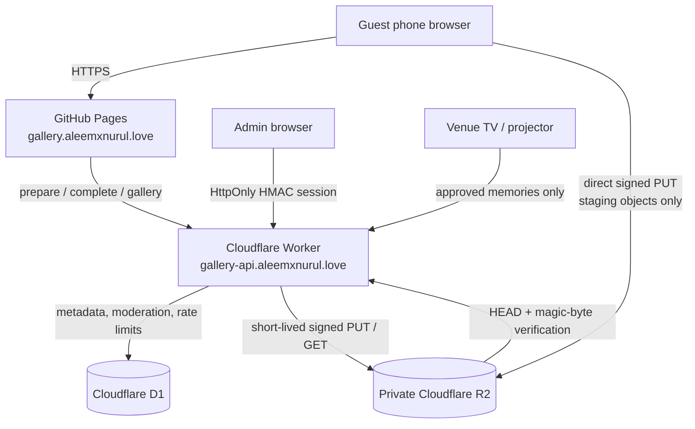

# Aleem × Nurul — Flight Memories

A production-oriented, browser-first wedding guest photo and video gallery for 21–22 August 2027. Guests can scan one QR code, take or choose media, add an optional name and message, upload without an account, and browse approved memories. The same site also provides a full-screen live wall, printable QR card, and a separate moderation console.

The frontend is static React + Vite on GitHub Pages. The API is a Cloudflare Worker backed by private R2 storage and D1 metadata.

## Architecture



Uploads never send large media bytes through Worker memory. The Worker validates the request, creates an `uploading` D1 record, and returns 10-minute S3-compatible signed R2 URLs for a disposable `staging/` prefix. The browser uploads directly to R2. The Worker then verifies object existence, exact size, signed content type, and file signature before using R2's server-side `CopyObject` operation to promote valid objects into never-signed final keys and move the record to `pending` or `approved`.

## What is included

- Mobile-first guest flow with camera capture and multi-file selection.
- Up to 20 files per batch; 25 MB images and 250 MB videos by default.
- JPEG, PNG, WebP, HEIC/HEIF, MP4, MOV, and WebM admission checks.
- Original-preserving browser derivatives: ~1800 px WebP display and 480 px WebP thumbnail.
- Per-file and overall upload progress, partial-failure recovery, and individual retry.
- Singapore-time event defaulting for 21 and 22 August 2027.
- SHA-256 duplicate fingerprints scoped to the same browser and event.
- Approved-only paginated gallery, filters, lazy thumbnails, lightbox, keyboard/swipe navigation, and sharing.
- English and Bahasa Melayu guest interface with local preference storage.
- `/live` polling wall with non-repeating rotation, preloading, muted video, filters, QR, and fullscreen mode.
- `/qr` high-contrast printable boarding card.
- `/admin` password login, HMAC-signed HttpOnly session, statistics, storage breakdown, moderation, event switches, auto-approval, and live-wall controls.
- Private R2, exact-origin CORS, Turnstile, hashed IP/session rate limits, post-upload verification, and scheduled stale-upload cleanup.
- D1 migrations, GitHub Pages and Worker workflows, generated non-copyrighted preview artwork, and automated frontend/Worker tests.

Generation provenance, saved paths, and the exact image prompt are recorded in [`docs/IMAGE_ASSETS.md`](docs/IMAGE_ASSETS.md).

## Repository map

```text
.
├── src/
│   ├── components/        guest, upload, gallery, QR, and admin UI
│   ├── context/           locale state
│   ├── data/              generated development preview records
│   ├── i18n/              English / Bahasa Melayu copy
│   ├── pages/             home, live wall, QR, and admin routes
│   ├── services/          API and resilient direct-upload client
│   ├── styles/            shared design system and responsive surfaces
│   ├── types/             browser-only types
│   └── utils/             dates, validation, fingerprints, derivatives
├── shared/contracts.ts    frontend / Worker request-response contracts
├── worker/
│   ├── migrations/        production D1 schema and event seed
│   ├── seeds/             optional local development marker
│   ├── src/               API routes, security, R2, and scheduled cleanup
│   ├── wrangler.toml      D1, R2, cron, vars, and custom domain
│   └── r2-cors.*.json     separate production / local CORS policies
├── public/                CNAME, privacy files, OG art, and generated samples
└── .github/workflows/     GitHub Pages and Worker deployment
```

## Local frontend

Requirements: Node.js 24+ and npm 11+.

```bash
npm install
cp .env.example .env.local
npm run dev
```

PowerShell equivalent: `Copy-Item .env.example .env.local`.

The default local experience uses generated, clearly labelled preview media and simulated uploads, so `/`, `/admin`, `/live`, and `/qr` are immediately reviewable without Cloudflare credentials.

To connect the frontend to a Worker, set this in `.env.local` and restart Vite:

```dotenv
VITE_API_BASE_URL=http://localhost:8787
VITE_TURNSTILE_SITE_KEY=1x00000000000000000000AA
VITE_USE_MOCK_DATA=false
```

Vite variables are public browser configuration. Never put R2 credentials, Turnstile secrets, or the admin password in a `VITE_` variable.

## Local Worker and D1

Authenticate Wrangler:

```bash
npx wrangler login
```

Create a local secrets file from the safe example:

```bash
cp worker/.dev.vars.example worker/.dev.vars
```

PowerShell equivalent: `Copy-Item worker/.dev.vars.example worker/.dev.vars`.

Apply the D1 schema to Wrangler's local persisted state and start the Worker:

```bash
npm run db:migrate:local
npm run db:seed:local
npm run dev:worker
```

The development seed adds metadata-only pending/rejected photo and video rows for D1 statistics and moderation tests. The default frontend mock mode supplies the generated visual media because local Wrangler S3 URLs are not browser-equivalent to hosted R2.

The explicit Turnstile bypass only works when `ENVIRONMENT=development`, `TURNSTILE_BYPASS=true`, and the client sends the exact development token. Production refuses a bypass configuration.

Wrangler's local R2 binding is useful for API and cleanup development, but local S3 presigned URLs do not represent the hosted R2 S3 endpoint. Use the frontend's simulated-upload mode for ordinary local UI work. Use a separately deployed development Worker and development bucket for a true end-to-end signed-upload smoke test.

Keep the browser and API hostnames consistent during local admin testing: use `localhost` for both URLs, or `127.0.0.1` for both. Mixing them can prevent the development `SameSite=Strict` admin cookie from being sent.

## Create the production Cloudflare resources

Run these after `wrangler login`:

```bash
npx wrangler r2 bucket create aleem-nurul-gallery
npx wrangler d1 create aleem-nurul-gallery-db
```

The D1 command prints a database UUID. Replace `REPLACE_WITH_D1_DATABASE_ID` in `worker/wrangler.toml` with that exact value. Find the Cloudflare account ID in the dashboard's account overview or the Worker overview and replace `REPLACE_WITH_CLOUDFLARE_ACCOUNT_ID`.

Apply the schema remotely:

```bash
npx wrangler d1 migrations apply aleem-nurul-gallery-db --remote --config worker/wrangler.toml --env=""
```

D1 migrations are applied transactionally and Wrangler captures a backup before each production migration.

### Create bucket-scoped R2 signing credentials

The Worker R2 binding can inspect and delete objects, but S3-compatible credentials are required to mint browser presigned URLs.

1. Open Cloudflare Dashboard → **R2 Object Storage** → **Manage R2 API tokens**.
2. Create an **Object Read & Write** token restricted to `aleem-nurul-gallery`.
3. Save the access key ID and secret access key when shown. The secret is only displayed once.
4. Do not enable the bucket's `r2.dev` public URL or attach a public bucket domain.

Apply the production R2 CORS rule:

```bash
npx wrangler r2 bucket cors set aleem-nurul-gallery --file worker/r2-cors.production.json --force
npx wrangler r2 bucket lifecycle add aleem-nurul-gallery expire-gallery-staging staging/ --expire-days 1
```

API CORS and R2 bucket CORS are separate. The production R2 rule permits only `https://gallery.aleemxnurul.love` and the exact signed `Content-Type` / `If-None-Match` headers. The one-day `staging/` lifecycle is a backstop; scheduled cleanup normally removes staged objects shortly after the last PUT expires.

## Configure Turnstile

1. Cloudflare Dashboard → **Turnstile** → **Add widget**.
2. Add `gallery.aleemxnurul.love` as the production hostname.
3. Put the public site key in the GitHub Actions variable `VITE_TURNSTILE_SITE_KEY`.
4. Put the secret key in the Worker secret `TURNSTILE_SECRET_KEY`.

The Worker checks `success`, hostname, action `upload_prepare`, expiry, and single-use validation. The example local keys are Cloudflare's documented test keys and are not production credentials.

## Worker secrets

Generate strong independent values for the admin password and both signing secrets. For example:

```bash
openssl rand -base64 36
openssl rand -base64 48
openssl rand -base64 48
```

Set each value interactively; do not paste it into a committed file:

```bash
npx wrangler secret put R2_ACCESS_KEY_ID --config worker/wrangler.toml --env=""
npx wrangler secret put R2_SECRET_ACCESS_KEY --config worker/wrangler.toml --env=""
npx wrangler secret put TURNSTILE_SECRET_KEY --config worker/wrangler.toml --env=""
npx wrangler secret put ADMIN_PASSWORD --config worker/wrangler.toml --env=""
npx wrangler secret put ADMIN_SESSION_SECRET --config worker/wrangler.toml --env=""
npx wrangler secret put RATE_LIMIT_SECRET --config worker/wrangler.toml --env=""
```

`ADMIN_SESSION_SECRET` and `RATE_LIMIT_SECRET` should each contain at least 32 random characters. Raw IP addresses are not written to D1; rate-limit keys are HMAC-hashed first.

## Production configuration reference

Non-secret production settings live in `worker/wrangler.toml`; browser-visible settings live in the GitHub Pages workflow or `.env.local`.

| Setting | Production value / purpose |
| --- | --- |
| `R2_ACCOUNT_ID` | The 32-character account ID from Cloudflare; replace the placeholder. |
| `R2_BUCKET_NAME` | `aleem-nurul-gallery`; must match the private bucket and scoped signing token. |
| `ALLOWED_ORIGIN` | Exact single origin `https://gallery.aleemxnurul.love`; production rejects comma-separated or non-HTTPS values. |
| `TURNSTILE_EXPECTED_HOSTNAME` | `gallery.aleemxnurul.love`; must match `ALLOWED_ORIGIN`. |
| `TURNSTILE_BYPASS` | Must remain `false` in production. |
| `AUTO_APPROVE_UPLOADS` | Default moderation mode; `false` sends completed uploads to the pending queue. Admin can override it at runtime. |
| `UPLOAD_URL_TTL_SECONDS` | Signed PUT lifetime; default 600 seconds and clamped to 60–900 seconds. |
| `ADMIN_SESSION_TTL_SECONDS` | Admin session lifetime; default 28,800 seconds (8 hours), clamped to 15 minutes–24 hours. |
| `SOFT_STORAGE_WARNING_GB` | Informational dashboard warning; default 450 GB. |
| `HARD_STORAGE_LIMIT_GB` | Optional admission cap. Leave empty for unlimited storage. |
| `VITE_API_BASE_URL` | Public Worker origin compiled into the Pages build. |
| `VITE_TURNSTILE_SITE_KEY` | Public Turnstile site key compiled into the Pages build; it is not a secret. |

`ENVIRONMENT=production` is deliberate. The Worker validates all production identifiers and secrets at request startup and fails closed if a placeholder or development bypass remains.

## Deploy the Worker

Validate the Worker bundle without deploying:

```bash
npm run typecheck:worker
npm run build:worker
```

Deploy after the resource IDs and secrets are configured:

```bash
npx wrangler deploy --config worker/wrangler.toml --env=""
```

The config declares `gallery-api.aleemxnurul.love` as a Worker custom domain. The zone must be active in the same Cloudflare account. Confirm the domain in **Workers & Pages → aleem-nurul-gallery-api → Settings → Domains & Routes**; Cloudflare creates/manages the custom-domain DNS record rather than requiring an invented Worker target.

The cron runs every 15 minutes. It reconciles expired `uploading` records, salvages valid originals into moderation, purges invalid/incomplete objects, finishes interrupted deletions, re-purges keys that a still-valid PUT URL could recreate, and clears expired request/rate-limit/session rows. Each pass uses bounded batches sized to remain below D1's 50-query Workers Free invocation limit; a large backlog drains over subsequent passes while the one-day R2 lifecycle remains the safety net.

## GitHub Pages

1. Push this repository to GitHub with `main` as the production branch.
2. Repository **Settings → Pages → Build and deployment → Source**: choose **GitHub Actions**.
3. Repository **Settings → Secrets and variables → Actions → Variables**: add `VITE_TURNSTILE_SITE_KEY`.
4. Run **Deploy gallery to GitHub Pages** or push to `main`.
5. In **Settings → Pages**, set the custom domain to `gallery.aleemxnurul.love` and enable HTTPS after the certificate is ready.

`public/CNAME` is already included. The workflow lints, tests, builds, and deploys `dist/`. `public/404.html` preserves clean `/live`, `/admin`, and `/qr` routes when GitHub Pages serves its SPA fallback.

## Worker GitHub Actions

Create a dedicated, least-privilege Cloudflare token for this workflow:

1. Cloudflare Dashboard → **My Profile → API Tokens → Create Token → Create Custom Token**.
2. Add account permissions **Account Settings: Read**, **Workers Scripts: Edit**, **D1: Edit**, and **Workers R2 Storage: Edit** (the current UI may label the last permission “Write”).
3. Add zone permission **Workers Routes: Edit** for only the `aleemxnurul.love` zone so Wrangler can manage the declared Worker custom domain.
4. Scope **Account Resources** to the one wedding-gallery account and **Zone Resources** to the one wedding domain; do not select all accounts or zones.
5. Create the token, copy it once, and store it only as the GitHub secret below. This deployment token is separate from the bucket-scoped S3 access key used by the Worker to sign media URLs.

In GitHub, open **Repository Settings → Secrets and variables → Actions → Secrets → New repository secret** and add:

- `CLOUDFLARE_API_TOKEN`
- `CLOUDFLARE_ACCOUNT_ID`

The **Deploy gallery API Worker** workflow type-checks and tests, applies unapplied D1 migrations remotely, and only then deploys the Worker. It also supports manual `workflow_dispatch`.

## DNS handoff

Do not guess provider-specific targets.

- `gallery.aleemxnurul.love`: use the exact CNAME target shown by GitHub in **Repository Settings → Pages → Custom domain**. If Cloudflare hosts DNS, start DNS-only while GitHub validates and provisions HTTPS; adjust proxying only after the custom domain is healthy.
- `gallery-api.aleemxnurul.love`: confirm the Worker custom domain in Cloudflare's **Domains & Routes** screen. The Wrangler `custom_domain` declaration provisions the appropriate record inside the active Cloudflare zone.

Verify both hostnames over HTTPS before placing the QR code at the venue.

## R2 object layout

```text
staging/2027-08-21/<uuid>/original.jpg        # temporary signed target
staging/2027-08-21/<uuid>/display.webp
staging/2027-08-21/<uuid>/thumbnail.webp

originals/2027-08-21/<uuid>/original.jpg
display/2027-08-21/<uuid>.webp
thumbnails/2027-08-21/<uuid>.webp
```

The same layout is used for 22 August. UUIDs and keys are generated by the Worker; original filenames are metadata only. Guests can write only to `staging/`. Final gallery keys are created by authenticated, server-side R2 copies and are never exposed as PUT targets.

## API surface

```text
GET    /api/events
POST   /api/uploads/prepare
POST   /api/uploads/:id/refresh
POST   /api/uploads/:id/complete
GET    /api/gallery
GET    /api/gallery/:id
GET    /api/live/config

POST   /api/admin/login
POST   /api/admin/logout
GET    /api/admin/session
GET    /api/admin/stats
GET    /api/admin/media
PATCH  /api/admin/media/batch
DELETE /api/admin/media/:id
GET    /api/admin/settings
PATCH  /api/admin/settings
```

All responses use a typed `{ ok, data }` or `{ ok, error }` envelope. Raw D1, R2, stack, and exception details are never returned to guests.

## Quality checks

```bash
npm run lint
npm test
npm run build
npm run build:worker
```

The test suite covers Singapore date selection, upload queue success/failure/retry behavior, gallery filters, language preference, file validation, Turnstile rejection, missing/bad Origin, rate limiting, upload preparation, R2 completion failure, approved-only gallery SQL, admin password verification, unauthenticated admin rejection, and moderation transitions.

## Security and privacy notes

- The site sends `noindex,nofollow` and `robots.txt` disallows crawling.
- R2 remains private; gallery responses contain short-lived signed GET URLs only for approved records.
- Presigned URLs are bearer credentials. They are never stored in D1 or deliberately logged.
- `Content-Type` and `If-None-Match: *` are both cryptographically signed; a staged PUT cannot change type or overwrite an existing key.
- PUT authority is limited to an `uploading` row, rate-limited, and capped to a 30-minute total authorization window. Deleted or terminal rows cannot mint another PUT URL.
- A new prepare operation atomically claims its request ID in D1 before Turnstile verification. Turnstile tokens remain single-use and no browser-controlled value is used as a Siteverify idempotency key.
- Valid staged media is promoted to never-signed final keys with source/destination copy preconditions. Cron re-purges staging after URL expiry, and the one-day prefix lifecycle is a second safety net.
- Claimed file size is checked before signing; authoritative size, content type, and file signature are checked after R2 receives the object. R2 cannot enforce the 25/250 MB browser declaration before ingest, so short URL lifetimes, Turnstile, and rate limits mitigate—but cannot entirely eliminate—oversized bearer-URL abuse.
- Deleting or rejecting a memory removes it from APIs immediately. A signed GET URL already issued can remain valid until its short expiry.
- Admin cookies are host-only, HttpOnly, Secure, SameSite=Strict, HMAC-signed, D1-revocable, and sent only with credentialed API requests.
- Mutating endpoints require the exact configured Origin; production never uses wildcard CORS.
- No guest accounts, analytics, advertisements, social login, or public R2 directory are included.

## Known limitations and next improvements

- Videos are preserved but not transcoded; unusual codecs inside an accepted container may not play on every browser. A post-wedding media-processing queue could create standardized MP4 previews and video posters.
- Browser HEIC conversion is lazy-loaded and best-effort. The original still uploads when a derivative cannot be decoded; admin sees the derivative state.
- The live wall polls every 20 seconds instead of using a persistent real-time channel, which is intentionally simpler and resilient for a two-day event.
- D1/R2 changes are a recoverable saga, not one cross-service transaction. Intermediate statuses and cron reconciliation are therefore essential.
- Before the wedding, run a real-device rehearsal on iPhone Safari, Android Chrome, Samsung Internet, the venue Wi-Fi, and the actual projector. Test a maximum-size video and a connection drop during a mixed batch.

Recommended later improvements are server-side image/video processing, an optional private access code if the couple wants post-event protection, offline background upload resumption where browser support is reliable, and automated pre-event load testing against a non-production bucket/database.
