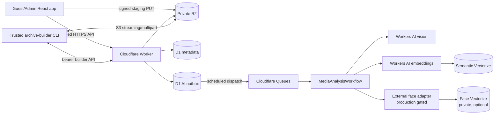
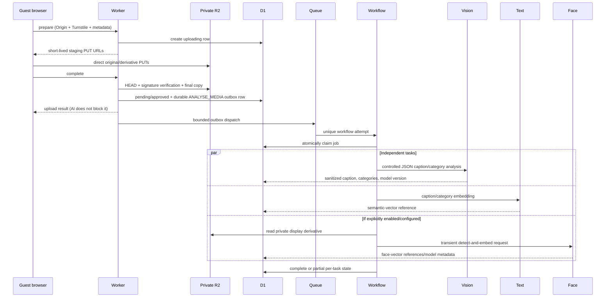
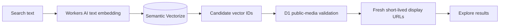
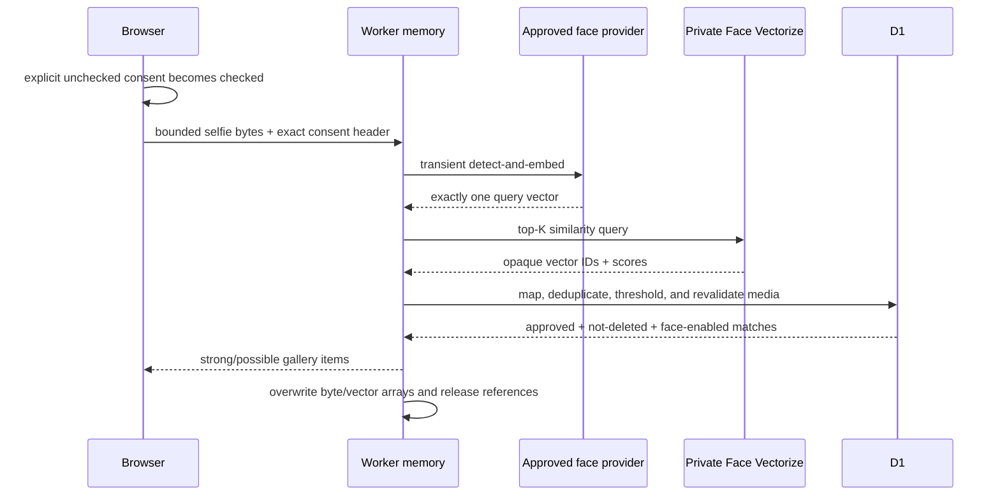
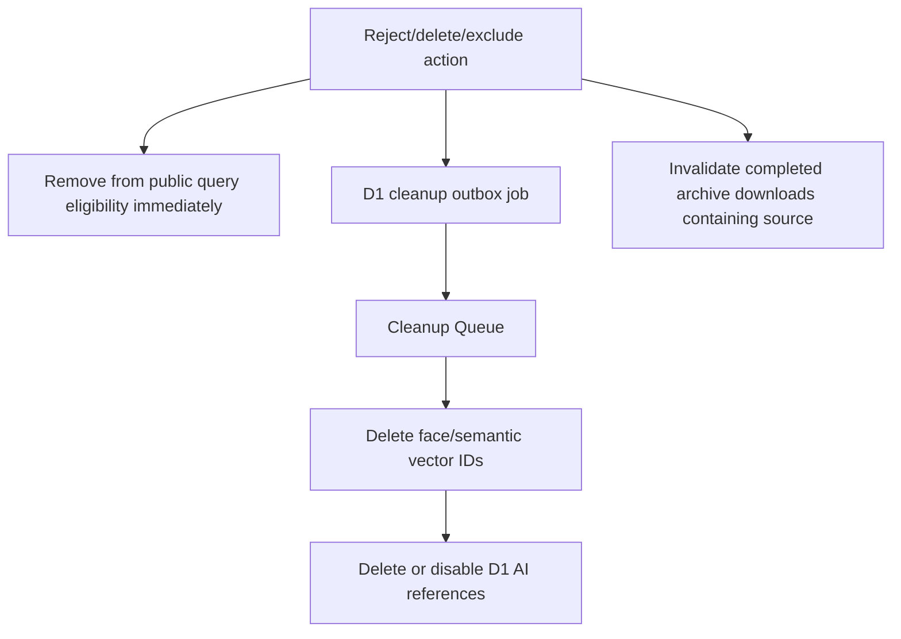

# Phase 2 architecture

Last reviewed: 6 September 2026.

Phase 2 adds durable, independently failing AI tasks, private vector search, event modes, local favourites, and offline archive construction while preserving the Phase 1 upload and moderation path.

## Component map



The Worker is the only policy boundary that joins vector candidates to media. R2 and both vector indexes remain private.

## Upload-to-analysis flow



`ai_jobs` is both the durable outbox and the idempotency ledger. Queue messages contain IDs, schema versions, and a per-dispatch token—not media bytes. Moderation and face-setting revisions generate deterministic logical job IDs; duplicate admin requests therefore do not buy duplicate analysis. Every write is fenced by the active logical generation, dispatch token, and concrete Workflow attempt ID. Retries and dead-letter handling never change public moderation state.

## Discovery

Category browsing is a D1 query and remains available if AI providers are down. Natural-language search embeds the submitted text, queries the semantic index without returning vector values/metadata, then resolves exact vector IDs through the current provider/model/version/dimensions/metric tuple before applying the central approved/non-deleted public-media predicate in D1. Local favourites store at most 100 opaque media IDs in the browser; signed URLs and media metadata are fetched fresh.



## Find Me



An active calibration must exactly match provider, model, version, dimensions, and metric. No production face provider or `FACE_INDEX` is committed; therefore production Find Me fails closed until those facts are supplied.

## Deletion consistency



Failures remain visible to admin retry/dead-letter tooling. Missing vector bindings fail cleanup closed so a D1 deletion cannot silently orphan private vectors.

## Archive flow

```mermaid
sequenceDiagram
  participant A as Admin
  participant W as Worker
  participant D as D1
  participant C as Builder CLI
  participant R as Private R2

  A->>W: create archive in post-wedding/archive mode
  W->>D: immutable inventory snapshot
  C->>W: claim lease generation
  C->>W: page inventory and persist deterministic part plans
  loop One shard at a time
    C->>R: stream each original
    C->>C: SHA-256 while appending ZIP64 stored entry
    C->>R: multipart-stream immutable shard key
    C->>W: register checksums and completed part under lease fence
  end
  C->>R: write content-addressed manifests/checksum/readme artifacts
  C->>W: register artifacts and request completion
  W->>D: verify exact coverage, plans, checksums, parts, artifacts, and live source rows
  W-->>A: complete; short-lived private downloads enabled
```

The builder uses ZIP64, stored entries, a fixed ZIP timestamp, stable order, deterministic safe names, multipart upload, 10,000-file shard caps, and a local `0600` resume-state file. It holds inventory/manifest metadata in memory but never a complete original or ZIP shard. Run it on a trusted 64-bit machine, measure heap use with a representative 100,000-item staging rehearsal, and keep reliable connectivity; shard bytes are streamed directly. Builder API plan/checksum writes use at most 15 items per request so they remain within D1 Free's 50-query invocation budget.

Lease generations fence stale builders inside every progress/checksum/part/artifact mutation. Plans are durable before bytes are written. Part and artifact keys include content/plan identity, so a changed plan cannot silently overwrite an earlier result; an uploaded part from a prior lease generation can be verified and registered by the current lease without copying it. A partial event-only run can later resume with `--all`.

## Event modes

| Mode | Uploads | Live wall | Explore/semantic | Find Me | Archive creation/download |
| --- | --- | --- | --- | --- | --- |
| `live` | Controlled by admin/event switches | On | On when enabled | On only when configured and enabled | Creation blocked |
| `post-wedding` | Off | Off | On when enabled | On only when configured and enabled | Available |
| `archive` | Off | Off | Category/gallery access remains; semantic disabled | Off | Available; reduced background activity |

Mode changes are explicit admin actions. Dates do not change modes automatically.

## Trust boundaries and observability

- Admin browser mutations require the exact origin plus an HttpOnly, host-only, signed/revocable session.
- Builder and maintenance APIs use separate 32-byte bearer secrets and are not browser endpoints.
- The provider key, R2 S3 secret, vectors, signed URLs, selfie bytes, passwords, and Turnstile tokens are never safe log fields.
- Structured logs use request/job/workflow/media IDs and stable error codes. Provider tasks can be paused; backfills and queue dispatch are bounded by `AI_PROCESSING_MAX_PER_MINUTE`.
- Archive downloads and gallery media use short-lived signed R2 GET URLs. The bucket has no public domain.
